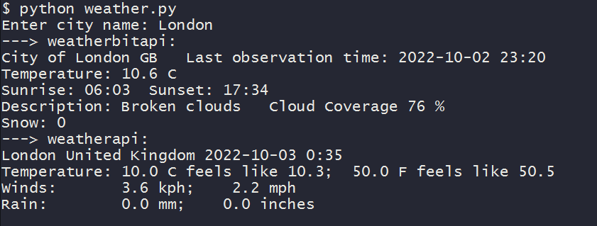

# pyweathur

### Retrieves live weather data from different APIs 

## External libraries used:

- <strong>httpx (`pip install httpx`)</strong>

### Notes:

`min python version: 3.7`

 **If for some reason python is not using utf-8 to print city names  (can result in an encoding error), try one of these methods**
- Set the environmental variable: `PYTHONUTF8=1`
- Pass the variable option directly (bash): `PYTHONUTF8=1 py weather.py`
- Pass the command line option directly: `py -Xutf8 weather.py`
- Set the FORCE_UTF8 flag to True inside the .py file: `FORCE_UTF8 = True`
